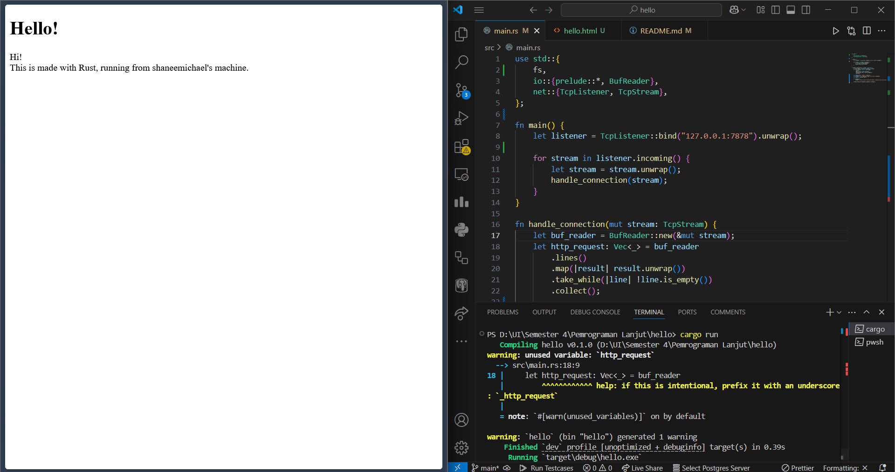
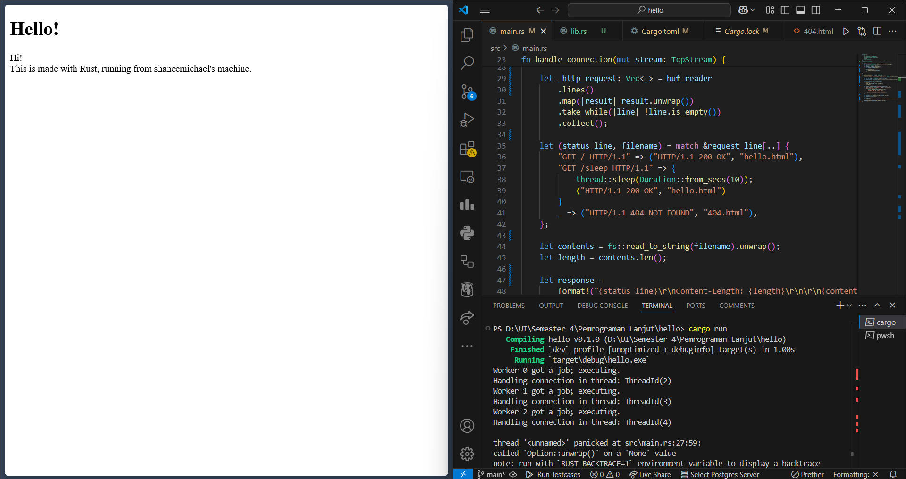

# Reflection of Advanced Programming
### Name: Shane Michael Tanata Tendy
### NPM: 2306259976
### Class: B

----

[Commit 1 Reflection](#commit-1-reflection)

[Commit 2 Reflection](#commit-2-reflection)

[Commit 3 Reflection](#commit-3-reflection)

[Commit 4 Reflection](#commit-4-reflection-1)

[Commit 5 Reflection](#commit-5-reflection-1)

[Commit Bonus Reflection](#commit-bonus-reflection)

----

### Commit 1 Reflection

#### Code Analysis
The code creates a minimalistic HTTP server that:
1. Binds to `127.0.0.1:7878` (localhost on port `7878`)
2. Listens for incoming TCP connections
3. Processes each connection by reading and parsing HTTP request headers
4. Prints the parsed request to the console

#### `handle_connection` function
```rust
fn handle_connection(mut stream: TcpStream) {
    let buf_reader = BufReader::new(&mut stream);
    let http_request: Vec<_> = buf_reader
        .lines()
        .map(|result| result.unwrap())
        .take_while(|line| !line.is_empty())
        .collect();
    println!("Request: {:#?}", http_request);
}
```
Analysis:
- `BufReader` provides buffering for our TCP stream, making reading operations more efficient
- `.lines()` yields an iterator over lines in the stream (each terminated by `\r\n`)
- `.map(|result| result.unwrap())` unwraps each `Result` into a `String` 
- `.take_while(|line| !line.is_empty())` keeps reading lines until an empty line is encountered, which in HTTP signifies the end of headers
- `.collect()` gathers all lines into a vector
- `println!("Request: {:#?}")` displays the vector with pretty formatting

### Commit 2 Reflection

#### `handle_connection` function
```rust
fn handle_connection(mut stream: TcpStream) {
    let buf_reader = BufReader::new(&mut stream);
    let http_request: Vec<_> = buf_reader
        .lines()
        .map(|result| result.unwrap())
        .take_while(|line| !line.is_empty())
        .collect();
    
    let status_line = "HTTP/1.1 200 OK";
    let contents = fs::read_to_string("hello.html").unwrap();
    let length = contents.len();
    
    let response = 
        format!("{status_line}\r\nContent-Length: {length}\r\n\r\n{contents}");
    
    stream.write_all(response.as_bytes()).unwrap();
}
```
For the `handle_connection` function, there are several key changes:
- A status line `HTTP/1.1 200 OK` is created, indicating a successful response
- The server reads HTML content from a file named `hello.html` using `fs::read_to_string`
- The content length is calculated to create the proper `Content-Length` header
- A complete HTTP response is formed by combining:
    1. the status line
    2. headers
    3. HTML content
- The response is converted to bytes and written to the TCP stream

### Commit 3 Reflection

#### `handle_connection` function
```rust
fn handle_connection(mut stream: TcpStream) {
    let buf_reader = BufReader::new(&mut stream);
    let mut lines = buf_reader.lines();
    
    let request_line = lines.next().unwrap().unwrap();
    
    let _http_request: Vec<_> = lines
        .map(|result| result.unwrap())
        .take_while(|line| !line.is_empty())
        .collect();
    
    let (status_line, filename) = if request_line == "GET / HTTP/1.1" {
        ("HTTP/1.1 200 OK", "hello.html")
    } else {
        ("HTTP/1.1 404 NOT FOUND", "404.html")
    };
    
    let contents = fs::read_to_string(filename).unwrap();
    let length = contents.len();
    
    let response = 
        format!("{status_line}\r\nContent-Length: {length}\r\n\r\n{contents}");
    
    stream.write_all(response.as_bytes()).unwrap();
}
```
For the `handle_connection` function, there are several key changes:
- Extract the first line of the HTTP request which contains the method, path, and HTTP version
    ```rust
    let mut lines = buf_reader.lines();
    let request_line = lines.next().unwrap().unwrap();
    ```
- Implement a simple conditional to check if the request is for the root path (/)
    ```rust
    let (status_line, filename) = if request_line == "GET / HTTP/1.1" {
        ("HTTP/1.1 200 OK", "hello.html")
    } else {
        ("HTTP/1.1 404 NOT FOUND", "404.html")
    };
    ```
- Dynamic file selection based on the response
    ```rust
    let contents = fs::read_to_string(filename).unwrap();
    ```
- Handle Rust's ownership rules by getting an iterator from the buffer reader first
    ```rust
    let mut lines = buf_reader.lines();
    ```

### Commit 4 Reflection
#### `handle_connection` function
```rust
fn handle_connection(mut stream: TcpStream) {
    let buf_reader = BufReader::new(&mut stream);
    let mut lines = buf_reader.lines();
    
    let request_line = lines.next().unwrap().unwrap();
    
    let _http_request: Vec<_> = lines
        .map(|result| result.unwrap())
        .take_while(|line| !line.is_empty())
        .collect();
    
    let (status_line, filename) = match &request_line[..] {
        "GET / HTTP/1.1" => ("HTTP/1.1 200 OK", "hello.html"),
        "GET /sleep HTTP/1.1" => {
            thread::sleep(Duration::from_secs(10));
            ("HTTP/1.1 200 OK", "hello.html")
        }
        _ => ("HTTP/1.1 404 NOT FOUND", "404.html"),
    };
    
    let contents = fs::read_to_string(filename).unwrap();
    let length = contents.len();
    
    let response = 
        format!("{status_line}\r\nContent-Length: {length}\r\n\r\n{contents}");
    
    stream.write_all(response.as_bytes()).unwrap();
}
```
For the `handle_connection` function, there are several key changes:
- Replaced the simple `if-else` statement with a `match` expression that checks the request line pattern.
- Created a new match arm specifically for handling requests to "GET /sleep HTTP/1.1" that:
    1. Sleeps for 10 seconds using `thread::sleep(Duration::from_secs(10))`
    2. Returns the same `hello.html` page as the root endpoint
- Used pattern matching: `match &request_line[..]` syntax allows for more readable pattern matching against the string slice.

Reading from various resources, the `sleep` feature serves several important purposes in demonstrating the limitations of a single-threaded server, such as simulating slow operations, demonstrating blocking behavior, and becoming an example of a concurrency problem. However, `sleep` is not recommended in production server, as it's deliberately included as a way to expose the limitations of the single-threaded approach.

### Commit 5 Reflection
#### `main` function
```rust
fn main() {
    let listener = TcpListener::bind("127.0.0.1:7878").unwrap();
    let pool = ThreadPool::new(4); // added this

    for stream in listener.incoming() {
        let stream = stream.unwrap();
        
        pool.execute(|| {
            handle_connection(stream);
        });
    }
}
```
#### `handle_connection` function
```rust
fn handle_connection(mut stream: TcpStream) {
    println!("Handling connection in thread: {:?}", thread::current().id()); // for logging purpose

    let mut buf_reader = BufReader::new(&mut stream); // change to mutable var
    let request_line = buf_reader.by_ref().lines().next().unwrap().unwrap(); // using by_ref() since running in multi threads

    let _http_request: Vec<_> = buf_reader
        .lines()
        .map(|result| result.unwrap())
        .take_while(|line| !line.is_empty())
        .collect();

    let (status_line, filename) = match &request_line[..] {
        "GET / HTTP/1.1" => ("HTTP/1.1 200 OK", "hello.html"),
        "GET /sleep HTTP/1.1" => {
            thread::sleep(Duration::from_secs(10));
            ("HTTP/1.1 200 OK", "hello.html")
        }
        _ => ("HTTP/1.1 404 NOT FOUND", "404.html"),
    };

    let contents = fs::read_to_string(filename).unwrap();
    let length = contents.len();

    let response =
        format!("{status_line}\r\nContent-Length: {length}\r\n\r\n{contents}");

    stream.write_all(response.as_bytes()).unwrap();
}
``` 
This is the result from changing single-threading to multi-threading:

For this section, there are several key changes:
- Introducing a thread pool to manage a fixed number of worker threads rather than handling each connection in the main thread.
    ```rust
    let pool = ThreadPool::new(4); // Create a pool with 4 worker threads
    ```
- Instead of directly calling handle_connection, we're wrapping it in a closure and passing it to the thread pool for execution. 
    ```rust
    // Single-threaded (old):
    handle_connection(stream);

    // Multi-threaded (new):
    pool.execute(|| {
        handle_connection(stream);
    });
    ```
- Using `buf_reader.by_ref().lines()` instead of creating a separate `lines` variable. This allows us to continue using the same reader after consuming the first line.
- Additional debugging (initially because I use built-in `threadpool` instead of implement the one from the book)
    ```rust
    println!("Handling connection in thread: {:?}", thread::current().id());
    ```

By changing from single-threading to multi-threading, there are several key concepts that I learned, which are:
- Thread management: The ThreadPool creates a fixed number of worker threads at initialization rather than spawning new threads for each request, which prevents resource exhaustion under high load.
- Channel communication: Using `mpsc` channels provides a clean way for the main thread to dispatch jobs to worker threads.
- Ownership considerations: The `execute` method takes ownership of the closure and moves it to a worker thread, ensuring memory safety.
- Graceful shutdown: Implementing `Drop` for ThreadPool allows for cleanup when the server terminates.

### Commit Bonus Reflection
Several key changes in this section include:
- Error handling improvement: The `build` function returns a `Result` instead of panicking, which gives callers more control over error handling. This follows Rust's idiom of making errors explicit in the return type.
- API flexibility: While `new` remains as a convenient constructor that panics on invalid input (maintaining backward compatibility), `build` provides a more flexible alternative that lets callers decide how to handle errors.
- Future extensibility: The `build` function sets up a foundation for adding more configuration options in the future. For example, it could be extended to accept parameters for thread names, priorities, or custom thread initialization. 
- Better testing: Functions that return `Result` are generally easier to test than those that might panic, making the code more maintainable.

This pattern is common in mature Rust libraries and demonstrates a balance between convenience (the new function) and control (the build function). It follows the principle that constructors that might fail should return Result rather than panicking.