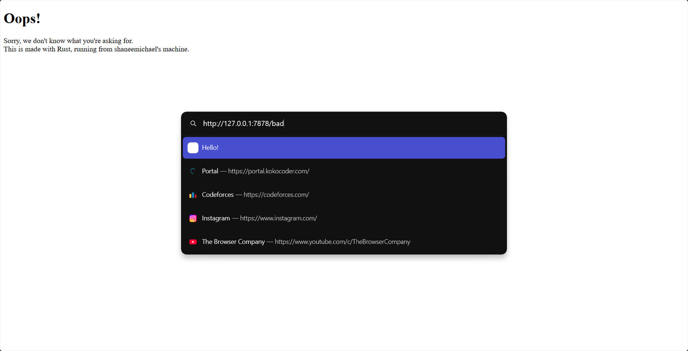

# Reflection of Advanced Programming
### Name: Shane Michael Tanata Tendy
### NPM: 2306259976
### Class: B

----

[Commit 1 Reflection](#commit-1-reflection)

[Commit 2 Reflection](#commit-2-reflection)

[Commit 3 Reflection](#)

----

### Commit 1 Reflection

#### Code Analysis
The code creates a minimalistic HTTP server that:
1. Binds to `127.0.0.1:7878` (localhost on port `7878`)
2. Listens for incoming TCP connections
3. Processes each connection by reading and parsing HTTP request headers
4. Prints the parsed request to the console

#### `handle_connection` function
```rust
fn handle_connection(mut stream: TcpStream) {
    let buf_reader = BufReader::new(&mut stream);
    let http_request: Vec<_> = buf_reader
        .lines()
        .map(|result| result.unwrap())
        .take_while(|line| !line.is_empty())
        .collect();
    println!("Request: {:#?}", http_request);
}
```
Analysis:
- `BufReader` provides buffering for our TCP stream, making reading operations more efficient
- `.lines()` yields an iterator over lines in the stream (each terminated by `\r\n`)
- `.map(|result| result.unwrap())` unwraps each `Result` into a `String` 
- `.take_while(|line| !line.is_empty())` keeps reading lines until an empty line is encountered, which in HTTP signifies the end of headers
- `.collect()` gathers all lines into a vector
- `println!("Request: {:#?}")` displays the vector with pretty formatting

### Commit 2 Reflection

#### `handle_connection` function
```rust
fn handle_connection(mut stream: TcpStream) {
    let buf_reader = BufReader::new(&mut stream);
    let http_request: Vec<_> = buf_reader
        .lines()
        .map(|result| result.unwrap())
        .take_while(|line| !line.is_empty())
        .collect();
    
    let status_line = "HTTP/1.1 200 OK";
    let contents = fs::read_to_string("hello.html").unwrap();
    let length = contents.len();
    
    let response = 
        format!("{status_line}\r\nContent-Length: {length}\r\n\r\n{contents}");
    
    stream.write_all(response.as_bytes()).unwrap();
}
```
For the `handle_connection` function, there are several key changes:
- A status line `HTTP/1.1 200 OK` is created, indicating a successful response
- The server reads HTML content from a file named `hello.html` using `fs::read_to_string`
- The content length is calculated to create the proper `Content-Length` header
- A complete HTTP response is formed by combining:
    1. the status line
    2. headers
    3. HTML content
- The response is converted to bytes and written to the TCP stream

### Commit 3 Reflection

#### `handle_connection` function
```rust
fn handle_connection(mut stream: TcpStream) {
    let buf_reader = BufReader::new(&mut stream);
    let mut lines = buf_reader.lines();
    
    let request_line = lines.next().unwrap().unwrap();
    
    let _http_request: Vec<_> = lines
        .map(|result| result.unwrap())
        .take_while(|line| !line.is_empty())
        .collect();
    
    let (status_line, filename) = if request_line == "GET / HTTP/1.1" {
        ("HTTP/1.1 200 OK", "hello.html")
    } else {
        ("HTTP/1.1 404 NOT FOUND", "404.html")
    };
    
    let contents = fs::read_to_string(filename).unwrap();
    let length = contents.len();
    
    let response = 
        format!("{status_line}\r\nContent-Length: {length}\r\n\r\n{contents}");
    
    stream.write_all(response.as_bytes()).unwrap();
}
```
For the `handle_connection` function, there are several key changes:
- Extract the first line of the HTTP request which contains the method, path, and HTTP version
    ```rust
    let mut lines = buf_reader.lines();
    let request_line = lines.next().unwrap().unwrap();
    ```
- Implement a simple conditional to check if the request is for the root path (/)
    ```rust
    let (status_line, filename) = if request_line == "GET / HTTP/1.1" {
        ("HTTP/1.1 200 OK", "hello.html")
    } else {
        ("HTTP/1.1 404 NOT FOUND", "404.html")
    };
    ```
- Dynamic file selection based on the response
    ```rust
    let contents = fs::read_to_string(filename).unwrap();
    ```
- Handle Rust's ownership rules by getting an iterator from the buffer reader first
    ```rust
    let mut lines = buf_reader.lines();
    ```
    
